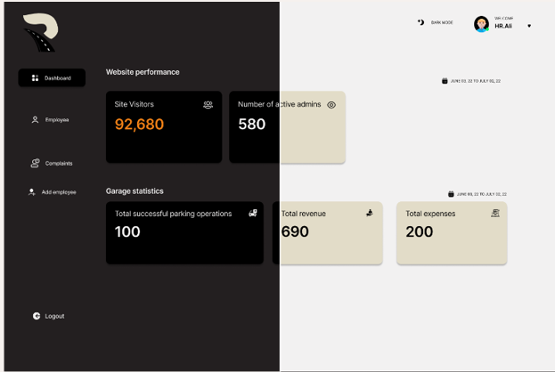
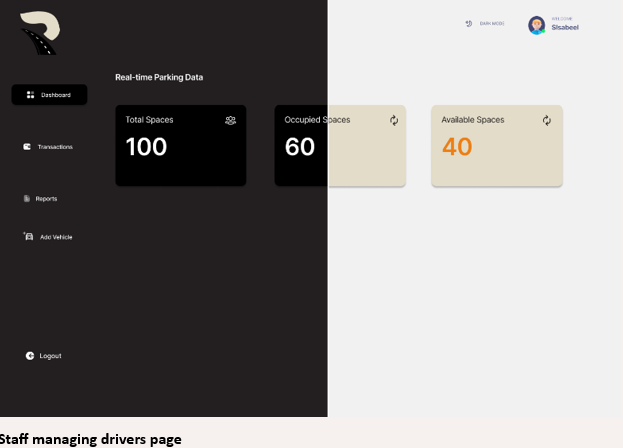
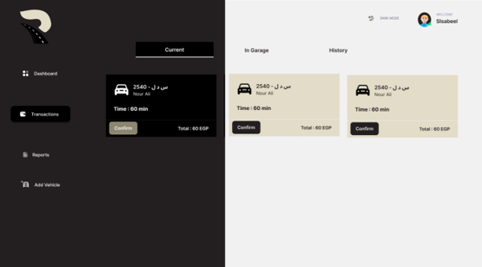
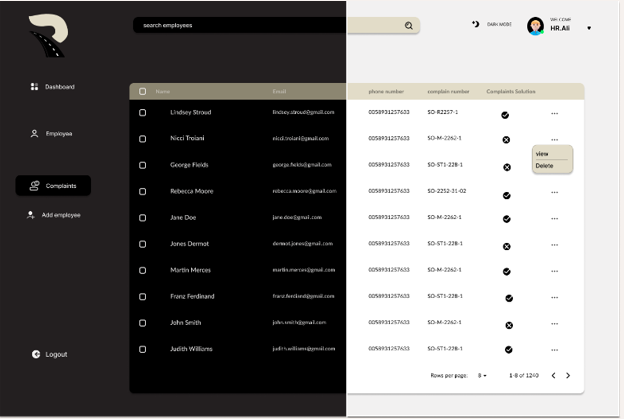
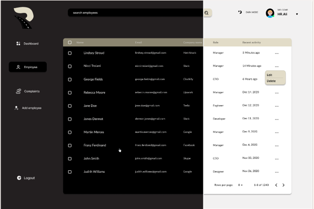

# Rakna - Parking Management System

Rakna is a comprehensive parking management system developed as a graduation project. The system is designed to facilitate the management of parking spaces, reservations, and user interactions for various users including drivers, garage staff, and system administrators. The backend API is built using .NET Core, Entity Framework, SQL Database, SignalR, Serilog, Repository Pattern, Unit of Work, and follows a 3-Tier Architecture.

## Table of Contents

- [Project Description](#project-description)
- [Features](#features)
  - [System Features](#system-features)
  - [Technical Support Features](#technical-support-features)
  - [Customer Service Features](#customer-service-features)
  - [Driver Features](#driver-features)
  - [Staff Features](#staff-features)
  - [Garage Admin Features](#garage-admin-features)
- [Technologies Used](#technologies-used)
- [System Architecture](#system-architecture)
- [Screenshots](#screenshots)
- [Contributing](#contributing)

## Project Description

Rakana aims to provide a seamless and efficient way to manage parking-related operations, including space allocation, reservations, real-time tracking of parking sessions, and handling complaints. The system is intended to be used by drivers, garage staff, and system administrators to ensure smooth and organized management of parking facilities.

## Features

### System Features

1. **Authentication**: Secure authentication methods to verify user identities.
2. **Available Spaces**: Counts the number of cars entering and leaving the garage, informing drivers about available spaces before arrival.
3. **Car Plate Recognition**: Captures and recognizes car license plates using a camera system.
4. **Handle Payments**: Manages payment methods and configure pricing plans, making it easier for the user.
5. **Parking Time Calculation**: Calculates the parking time of the car from the moment it enters until it exits.
6. **Parking Cost Calculation**: Adjusts the parking pricing and displays the cost to the driver and staff.
7. **Multi-Language Ticket Support**: Determines the language and translates tickets into English to solve complaints more easily.
8. **Notification System**: Notifies users via email.

### Technical Support Features

1. **Reports**: View and handle reports.
2. **Garage Management**: View, add, edit, or remove garages.
3. **User Management**: View, add, edit, or remove garage admins or customer service personnel.
4. **Announcements**: Send bulk emails to multiple receivers.

### Customer Service Features

1. **Login**: Access the system using secure login methods.
2. **Access Reports**: Access reports in the database and handle complaints.
3. **Forward Problem**: Forward difficult reports to Technical Support or System Admin based on the problem.

### Driver Features

1. **Register Vehicles**: Add vehicles to the system for monitoring.
2. **Parking Availability**: View real-time parking availability at each garage.
3. **Parking Duration and Cost Tracking**: Track parking duration and cost.
4. **Final Duration and Cost**: View the final parking duration and cost upon exiting the garage.
5. **Payment Options**: Pay for parking using cash or credit cards.
6. **Save Payment Info**: Save card information for faster payment.
7. **Reports**: Submit complaints to customer service and access them later.
8. **Authentication**: Sign up and login to access data.
9. **Reservation**: Reserve a spot in a garage by paying in advance.
10. **Manage Profile**: View, update, or remove profile details.

### Staff Features

1. **Account Access**: Log in to manage parking operations.
2. **Real-Time Parking Data**: View the number of cars currently parked in the garage.
3. **Payment Collection and Confirmation**: Collect parking payments and confirm transactions.
4. **System Issue Reporting**: Report system issues or problems to customer services.
5. **Vehicle Information Review**: Review information for all vehicles parked in the garage.
6. **Manually Register Car**: Manually register car entry and exit if plate recognition fails.

### Garage Admin Features

1. **Account Access**: Log in to manage the parking garage.
2. **Employee Management**: View, add, or remove employees, and manage their salaries and accounts.
3. **Garage Statistics Review**: Review statistics such as occupancy rates, revenue, and expenses.
4. **Changing Hour Price Rate**: Change hour prices based on the time.
5. **Notify Staff**: Send bulk notification emails to staff.

## Technologies Used

- **.NET Core**: Backend framework.
- **Entity Framework Core**: ORM for database interactions.
- **SQL Server**: Relational database.
- **SignalR**: Real-time web functionality.
- **Serilog**: Logging library.
- **Repository Pattern**: Data access pattern.
- **Unit of Work**: Ensures data integrity.
- **3-Tier Architecture**: Separation of concerns.

## System Architecture

The project follows a 3-Tier Architecture:
- **Presentation Layer**: API Controllers.
- **Business Logic Layer**: Services and SignalR Hubs.
- **Data Access Layer**: Repositories and Entity Framework Context.
## Screenshots

### Dashboard Page for System Admin

### Dashboard Page for Staff Users

### Managing Drivers Page

### Complaints Page

### Employees Page

## Contributing
This project is maintained by the Rakna backend team. Special thanks to our dedicated contributors:

- **Martin Nady** 
- **Mohamed Abdulsayed**
